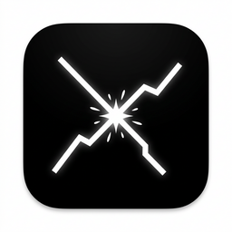

<div align="center">
  
  <h1>Friction</h1>
  <p><strong>The disagreement engine for AI-assisted code.</strong></p>

  <p>
    <a href="https://github.com/friction-labs/friction/actions/workflows/ci.yml"></a>
    <a href="https://github.com/friction-labs/friction/releases"></a>
    <a href="https://reactjs.org/"></a>
    <a href="https://tauri.app/"></a>
    <a href="https://tailwindcss.com/"></a>
    <a href="https://github.com/friction-labs/friction/blob/main/LICENSE"></a>
  </p>

  <p>
    <strong>Supported platforms:</strong> macOS (Apple Silicon &amp; Intel) · Linux (x86_64) · Windows (x86_64)
  </p>
</div>

---

**Friction** prevents LLM hallucinations and lazy coding by forcing AI agents into a structured disagreement. Instead of trusting a single AI output, Friction makes two isolated agents interpret the same requirement. It then highlights their divergences, putting *you* (the human) at the center of the architectural decision.

## ✨ Why Friction?

Most AI coding tools generate code and expect you to review it. But reviewing AI code is hard, especially when the AI takes shortcuts. Friction changes the paradigm:

1. **Dual-Agent Isolation**: Two different agents (e.g., Claude Code and OpenCode) analyze your requirement completely independently. They cannot "contaminate" each other's thought process.
2. **Divergence Highlighting**: The UI surfaces exactly where the agents disagree on the implementation plan.
3. **Adversarial Workflow (Phase 3)**: Agent A writes the code. Agent B reviews and attacks the final code in isolated Git worktrees.

## 🚀 Features (v1.2)

- **Bring Your Own CLI (BYOCLI)**: Supports `claude`, `codex`, `gemini`, and `opencode` out of the box.
- **Strict Isolation**: Each agent runs in its own temporary environment (`cwd`, `HOME`, configs) to ensure independent reasoning.
- **Local-First & Privacy-Focused**: Sessions are persisted locally using SQLite (`~/.friction/sessions.db`). No cloud telemetry.
- **Modern UI**: Built with `assistant-ui` for a seamless chat experience, retaining powerful custom UI cards for divergence and plan arbitration.
- **Reproducible Datasets**: Opt-in JSON export of sessions (dataset-compatible) with full meta-data.

## 🛠️ Tech Stack

- **Frontend**: React 18, Vite, Tailwind CSS, Radix UI, `assistant-ui`
- **Desktop Core**: Tauri 2 (Rust)
- **Local Storage**: SQLite (bundled via `rusqlite`)
- **Git Layer**: Native `git worktree` and `git diff` integration

## 📦 Installation & Setup

### Prerequisites

- Node.js (v20+)
- Rust (v1.77+)
- Cargo & Tauri CLI prerequisites (see [Tauri Docs](https://v2.tauri.app/start/prerequisites/))

### Running Locally

Clone the repository and install dependencies:

```bash
git clone https://github.com/friction-labs/friction.git
cd friction
npm install
```

Start the web frontend only:

```bash
npm run dev
```

Start the full Desktop App (Tauri):

```bash
npm run tauri dev
```

Build a debug version of the desktop app:

```bash
npm run tauri build -- --debug
```

## ⚙️ Configuration & CLI Onboarding

**Friction does not require a `.env` file for CLI models.** The application features a built-in onboarding and settings manager:

1. **First Launch**: A full-page onboarding screen will guide you to configure your Agent A and Agent B CLIs.
2. **Settings**: Navigate to `Settings > Agents` to define custom CLI command overrides and assign specific models to different phases.
3. **Model Selection**: Friction dynamically queries the CLIs (like `opencode models`) to provide a live-updating model picker. If unavailable, it falls back to sensible defaults.

> **Note on Codex (Isolation):** For Codex in phases 1 and 2, Friction requires either a non-empty `OPENAI_API_KEY` or an existing `auth.json` host file. Friction securely bridges this auth into the isolated temporary directory.

### Advanced: Phase 3 Trust Judge / Legacy Mode

While CLI agents are managed via the UI, some internal API keys (like the Trust Judge) can be set via environment variables if you prefer bypassing the CLI for specific tasks:

```bash
FRICTION_JUDGE_PROVIDER=haiku   # haiku | flash | ollama
FRICTION_JUDGE_MODEL=claude-3-5-haiku-latest
GEMINI_API_KEY=...              # Required if using flash
OLLAMA_HOST=http://localhost:11434
```

## 📂 Project Structure

```text
friction/
├── src-tauri/
│   ├── src/
│   │   ├── main.rs
│   │   ├── agents/     # CLI isolation and execution logic
│   │   ├── git/        # Git worktree management
│   │   ├── judge/      # Trust Judge LLM integration
│   │   └── session/    # SQLite local persistence
│   ├── capabilities/
│   ├── Cargo.toml
│   └── tauri.conf.json
├── src/
│   ├── components/
│   │   ├── ai-elements/ # AI-specific rendering components
│   │   ├── chat/        # Conversational interface (assistant-ui)
│   │   └── ui/          # Base UI components (Radix UI / shadcn)
│   ├── lib/             # App logic, orchestrator, state
│   ├── App.tsx
│   └── main.tsx
├── packaging/
│   └── homebrew/friction.rb
├── scripts/
│   └── release/macos-sign-notarize.sh
└── README.md
```

## 🤝 Contributing

Contributions are welcome! Please read [CONTRIBUTING.md](CONTRIBUTING.md) for setup instructions, code conventions, and the pull request process.

If you're encountering CLI mismatches or IPC state drift, refer to the **Runtime Diagnostics** panel in the app (Settings → Agents → Diagnostics) to debug binary path resolution and CLI readiness.

```bash
# Run backend tests
npm run test:backend

# Type-check frontend
npm run build
```

## 🍏 macOS Distribution

To notarize the app for macOS distribution, use the provided helper script:

```bash
scripts/release/macos-sign-notarize.sh
```

If the un-notarized app is quarantined by macOS Gatekeeper:

```bash
xattr -cr friction.app
```

## 📄 License

This project is licensed under the MIT License. See the [LICENSE](LICENSE) file for details.
